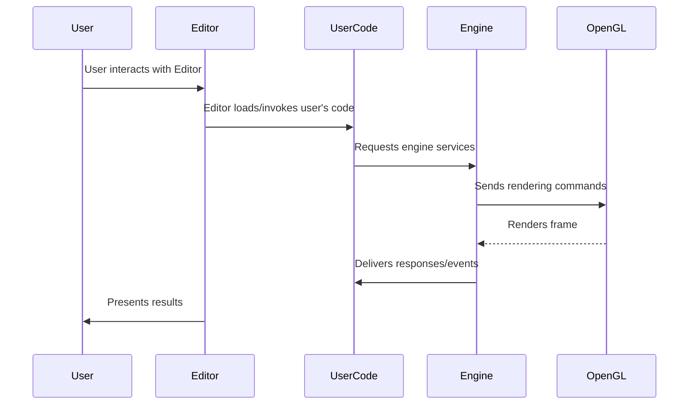

# Zeyrixon


TL;DR: Zeyrixon is a cross-platform (Linux/Windows) game engine + editor using OpenGL. macOS is not supported — PRs welcome.

**Table of contents**

- [Overview](#overview)
- [Quick start](#quick-start)
- [Generate projects](#generate-projects)
- [Build (Makefile)](#build-makefile)
- [Build (Visual Studio)](#build-visual-studio)
- [Run](#run)
- [Supported platforms](#supported-platforms)
- [Languages used](#languages-used)
- [Architecture diagram](#architecture-diagram)
- [Troubleshooting](#troubleshooting)
- [Contributing](#contributing)
- [License](#license)

## Overview

Zeyrixon is an engine + editor project built with C/C++ and OpenGL. The goal is to provide a lightweight, flexible engine that runs on Linux and Windows. The editor uses a custom workflow and premake for project generation.

## Quick start

Prerequisites:

- On Linux: a C/C++ toolchain (Clang or GCC), `make`, and `premake`.
- On Windows: Visual Studio (optional — see Visual Studio section).

Basic steps:

1. Generate project files:

```bash
# Linux
./GenerateProjects.sh

# Windows (PowerShell or cmd)
GenerateProjects.bat
```

2. Build (Makefile method) or open the generated solution in Visual Studio (see below).

## Generate projects

- Linux/macOS: `./GenerateProjects.sh` (creates Makefiles and workspace files).
- Windows: `GenerateProjects.bat` (creates Visual Studio solution and project files).

The scripts use premake to produce the appropriate project files.

## Build (Makefile)

From the engine root (after running the appropriate generate script):

```bash
make config=debug     # debug build
make config=release   # release build
make config=dist      # distribution build
```

Binaries are placed under `bin/Config-platform-architecture/` (for example `bin/Debug-linux-x86_64/`).

## Build (Visual Studio)

1. Run `GenerateProjects.bat` on Windows.
2. Open the generated `.sln` in Visual Studio.
3. Choose `Debug`, `Release`, or `Dist` and build.

## Run

After building, open the appropriate folder under `bin/` and run either `TestProj` or `ZeyrixonEditor`.

## Supported platforms

- Linux (actively tested on Arch Linux)
- Windows (tested via collaborators)

macOS is not supported by the author. If you get it working, open a PR — you will be credited.

## Languages used

| Language   | Where used                | Notes                         |
|---:        |---:                       |---:                           |
| C / C++    | Engine, Editor, User code | High performance core         |
| HTML / CSS | User-created UI           | For editor/user UI creation   |

## Architecture diagram



## Troubleshooting

- If builds fail: ensure you ran the appropriate `GenerateProjects` script first.
- On Linux, verify `gcc`/`clang`, `make`, and `premake` are installed and on `PATH`.
- If Windows builds fail for missing dependencies, check the vendor/ folders (e.g., GLFW, spdlog).

## Contributing

Contributions are welcome. If you want to add macOS support, submit a PR and include build instructions and CI if possible. For other contributions, open issues or PRs and include a brief description of your change.

## License

This project is released under the MIT License. See [LICENSE](LICENSE) for details.

---

Thanks for checking out Zeyrixon — enjoy!
